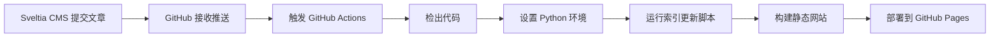

# Sveltia CMS 自动索引更新解决方案

## 🎯 问题描述

使用 Sveltia CMS 新增文章后，文章会自动构建并部署，但是 `content/` 目录下的 JSON 索引文件（如 `news.json`、`messages.json` 等）没有自动更新。

## ✅ 解决方案

我已经将索引更新功能集成到现有的 GitHub Actions 部署工作流中。现在每次 Sveltia CMS 推送内容变更时，都会自动更新所有 JSON 索引文件。

## 🔧 技术实现

### 修改的文件

1. **`.github/workflows/deploy.yml`** - 在构建过程中添加了索引更新步骤
2. **`rebuild-content-index.py`** - 现有的索引重建脚本（无需修改）

### 工作流程

## 🚀 工作流程详情

当 Sveltia CMS 推送内容变更时：

1. **检出代码** - GitHub Actions 检出最新的代码
2. **设置 Python** - 安装 Python 3.9 环境
3. **更新索引** - 运行 `rebuild-content-index.py` 脚本
4. **构建网站** - 准备静态网站文件
5. **部署** - 部署到 GitHub Pages

## 📁 自动更新的索引文件

脚本会自动扫描并更新以下索引文件：

- `content/news/news.json` - 新闻文章索引
- `content/messages/messages.json` - 消息索引
- `content/faq/faq.json` - FAQ 索引
- `content/stats/stats.json` - 统计数据索引

## 🔒 安全特性

- ✅ **无需 API** - 完全基于 Git 和 GitHub Actions
- ✅ **无外部依赖** - 只使用 GitHub 内置功能
- ✅ **权限最小化** - 只使用必要的 GitHub Pages 权限
- ✅ **无敏感信息** - 不存储任何 API 密钥或令牌
- ✅ **自动触发** - 无需手动干预

## 📊 监控和调试

### 查看工作流状态

1. 访问你的 GitHub 仓库
2. 点击 "Actions" 标签
3. 查看 "Deploy to GitHub Pages" 工作流
4. 点击最新的运行记录查看详细日志

### 常见问题

**Q: 索引文件没有更新怎么办？**
A: 检查 GitHub Actions 日志，确保 Python 脚本成功运行。

**Q: 可以手动触发更新吗？**
A: 可以！在 GitHub Actions 页面点击 "Run workflow" 按钮。

**Q: 如何添加新的内容目录？**
A: 脚本会自动检测所有包含 `.md` 文件的子目录，无需额外配置。

## 🎉 使用效果

现在当你通过 Sveltia CMS 添加新文章时：

1. 📝 在 Sveltia CMS 中创建新文章
2. 💾 保存并发布
3. 🔄 GitHub Actions 自动触发
4. 📄 JSON 索引文件自动更新
5. 🌐 网站自动部署更新

整个过程完全自动化，无需任何手动操作！
